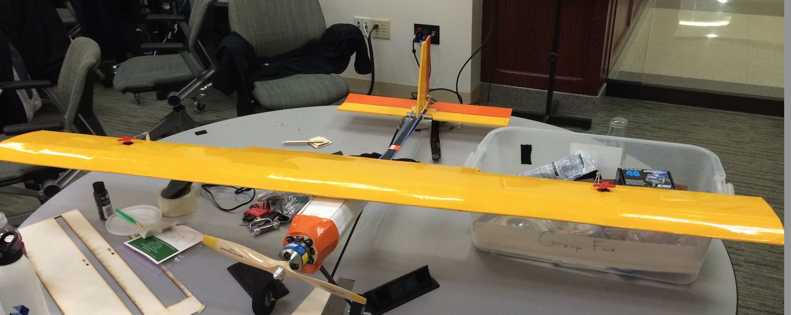
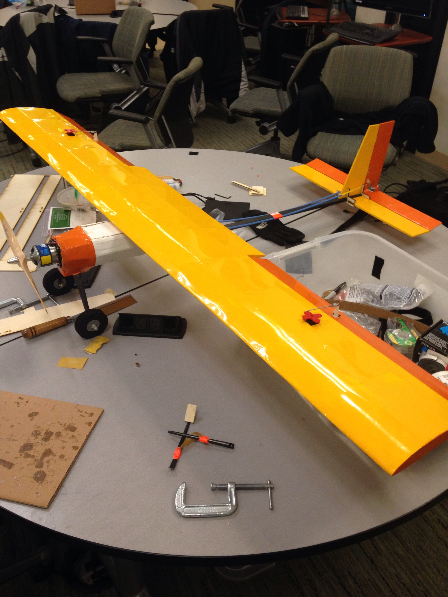
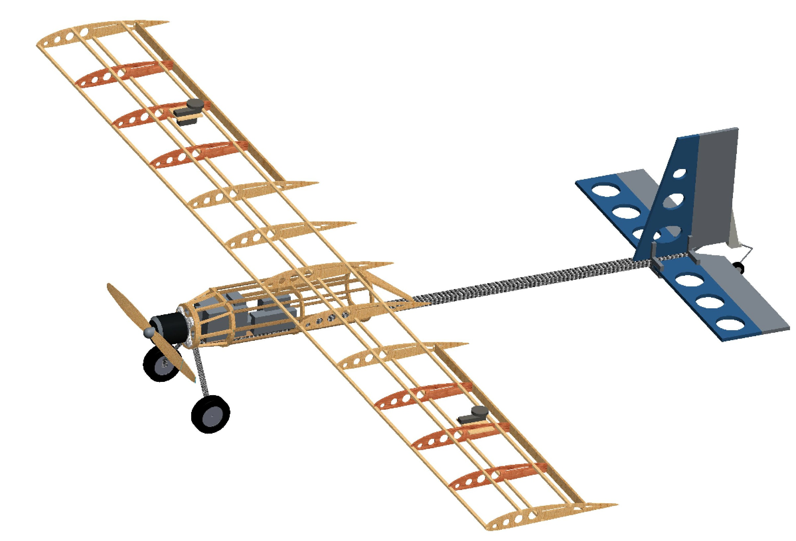

# Senior_Design

This repo hosts materials related to the design of "Flappy Bird", an endearingly-named RC airplane for our Notre Dame aerospace engineering senior design class. We designed, fabricated, and tested our airplane to perform to prescribed mission requirements.  

Our final report is located [here](/Box%20Files/Final%20Report/Final%20Report.pdf).

Takeoff and flight demo is located [here](Images/Takeoff_and_Flight.mov)

